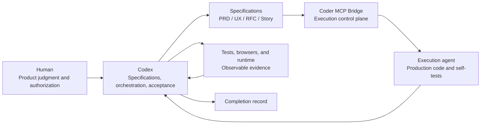
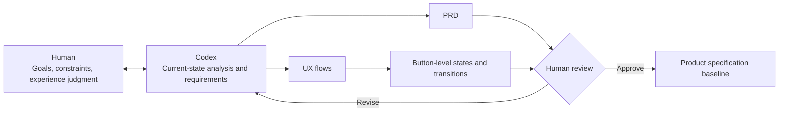
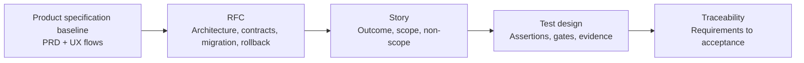
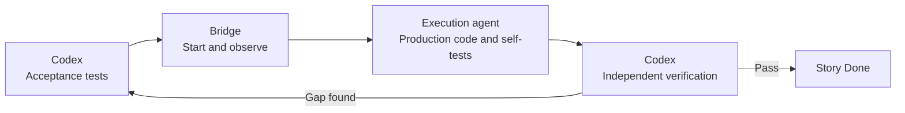

# Specification-Driven Development for Long-Running Agents

> The role of Coder MCP Bridge in separating requirements, execution, and acceptance

English | [简体中文](HARNESS-CONTEXT-ENGINEERING.zh-CN.md)

Long-running agent development spans requirements analysis, experience design, technical design, implementation, testing, and release preparation. Work crosses many conversations and execution sessions while product goals, engineering constraints, and code state continue to change. A single session can complete local work, but it cannot carry the entire development process by itself.

Specification-driven development progressively converts requirements into a PRD, UX flows, RFCs, and stories, then completes implementation and acceptance through explicit responsibility boundaries. Humans own product judgment and authorization. Codex owns specifications, orchestration, and acceptance. The execution agent owns production-code changes. The runtime environment provides observable evidence.

Coder MCP Bridge sits between the orchestrator and the execution agent, managing workspaces, resources, sessions, and events. It lets specification-defined task boundaries enter implementation reliably while keeping execution observable, steerable, and recoverable.

## 1. Core Problems in Long-Running Agent Development

Long-running work must solve two foundational problems at the same time: local implementation needs feedback that is fast and unambiguous, while the overall requirements must remain effective across many iterations. The first determines whether an agent can correct its current work. The second determines whether each local correction still moves toward the same product goal.

### 1.1 Ownership of Backpressure

The [Ralph Loop](https://ghuntley.com/ralph/) organizes long-running development as a sequence of local iterations. In each loop, an agent completes one bounded task, evaluates it through tests, type checks, builds, or other validation signals, and corrects failures. Backpressure rejects unacceptable output so the agent can determine whether its current change had the intended effect.

```text
Local implementation → Validation signal → Reject or accept → Next correction
```

Long-running work requires this feedback, but who defines the feedback matters just as much. If production code and backpressure are both controlled by the same execution session, the agent can make the signal pass by editing tests, replacing real data with mocks, adding fallback paths, or weakening assertions. The local loop still converges, but it may converge on an easier substitute for the original goal.

Giving all backpressure work to humans preserves independent acceptance, but it requires people to keep writing tests, observing runs, and issuing corrections. Development speed becomes constrained by manual feedback again. Fully automated development needs a different boundary: backpressure may be generated and executed automatically, but it cannot be owned and interpreted by the same session that implements the code.

### 1.2 Context Accumulation and Specification Decay

Specification-driven programming is often understood as placing a large collection of requirements and design documents into a session and asking the agent to keep implementing. A document being present in context does not mean it will continue to constrain the model throughout the development process.

Implementation continuously produces file reads, search results, tool calls, code diffs, compiler logs, test output, error diagnoses, and repair records. These intermediate results consume context. Specifications loaded early move farther away from the current decision point and may survive compaction only as summaries. The agent then reads only part of the specification or infers requirements from current code, and local implementation begins to drift from the full specification.

Subagent orchestration can distribute search, analysis, and implementation, but it does not solve the context problem by itself. A subagent receives a projection of the context: omitted business constraints do not recover themselves, and different subagents may reach conclusions from different file scopes, code states, and validation criteria. If the primary session accumulates every subtask result, logs and summaries still flow back into one finite context.

Context engineering must control what each iteration reads, what it preserves, and what it discards. Product specifications and engineering boundaries should live outside the session. Each run should load only the current story and its direct dependencies. Execution logs stay in the local session, while confirmed results are written back into traceable artifacts. The specification then becomes a constraint that every run can relocate, rather than background material seen only at the beginning of a long conversation.

### 1.3 Conflict Between Implementation and Acceptance

An execution agent can run tests and inspect its own implementation, but its self-test results are still produced within the implementation process. If the same executor may also modify stories, tests, and acceptance baselines, it can change the completion conditions while working until the original requirements fit the current code.

Specifications, production code, and acceptance decisions need distinct owners. Codex owns specifications, acceptance tests, and completion decisions. The execution agent owns production code and self-testing within the current story. Humans own product semantics, UX approval, and authorization to begin implementation.

This separation protects both sides: production code cannot bypass acceptance criteria, and acceptance criteria cannot drift away from the approved product specification. Tests must remain traceable to the PRD, UX flows, RFCs, and stories before test results can serve as completion evidence.

## 2. The Specification-Driven Development Method

The method starts with the participants and their positions, then moves into specification formation, execution, and acceptance. Collaboration defines who owns each artifact. The specification chain defines what must be delivered. The execution process converts specifications into reproducible engineering state.

### 2.1 Collaboration and Responsibilities

#### 2.1.1 Collaboration Structure

Humans sit at the product-decision end, and the execution agent sits at the code-implementation end. Codex connects product specifications to engineering delivery. Coder MCP Bridge provides the execution channel between them, while tests, browsers, and runtime environments return acceptance evidence to Codex.



#### 2.1.2 Responsibilities and Write Authority

| Participant | Responsibilities and write authority |
|---|---|
| Human | Define product semantics and business rules, approve the PRD and UX flows, and authorize implementation |
| Codex | Maintain the PRD, RFCs, and stories; write acceptance tests; orchestrate execution; review code; and determine completion |
| Execution agent | Modify production code and run self-tests within the current story; do not modify specifications or acceptance baselines |
| Bridge | Manage workspace access, resource leases, session continuation, event observation, context compaction, and recovery |
| Tests and runtime environment | Provide observable contract, behavior, UI, migration, and security results |

#### 2.1.3 Artifact Boundaries

Each artifact has an explicit source of modification and direction of use:

```text
Product judgment → PRD / UX flows
PRD / UX flows → RFCs
RFCs → Stories
Story → Acceptance tests and execution context
Production code and runtime results → Acceptance evidence
Acceptance evidence → Completion record
```

### 2.2 Specification Formation

#### 2.2.1 Product Specification

Product specification begins with a requirements discussion between the human and Codex. Together they use the current implementation, business rules, and user journeys to form a corresponding PRD and set of UX flows. The PRD defines product goals and acceptance requirements. UX flows map those requirements to pages, states, and button-level transitions.



Human approval is the completion condition for the product specification. Generated screens, a written PRD, or a completed tool call cannot replace the approval decision.

#### 2.2.2 Engineering Specification

After the product specification is approved, Codex converts it into RFCs and stories. RFCs establish technical boundaries, stories establish execution boundaries, and test designs establish acceptance boundaries.



| Artifact | Stored content | Scope |
|---|---|---|
| PRD | Product goals, business rules, scope, and acceptance requirements | Product version |
| UX flow | Page states, button actions, transitions, and recovery paths | User journey |
| RFC | Technical boundaries, interface contracts, migration, and rollback | Technical subject |
| Story | Single outcome, code boundary, non-scope, and test requirements | One execution unit |
| Test design | Executable assertions, regression gates, and evidence requirements | Story acceptance |

#### 2.2.3 Authorization to Implement

Completing the specification and beginning implementation are separate states. The PRD, UX flows, RFCs, and stories may already form a complete traceability chain, but Codex sends a story to the execution agent only after explicit human authorization.

The authorization gate confirms that product semantics are stable, the implementation order is accepted, migration risks are understood, and the current story has a sufficiently precise boundary. Work that has not been authorized remains a specification and does not enter production code.

### 2.3 Execution and Acceptance

#### 2.3.1 Story Context

After implementation is authorized, Codex selects the next story according to RFC dependencies. The current story becomes a bounded execution context containing:

- The related PRD, UX flows, and RFC;
- One delivery outcome;
- Permitted code paths;
- Explicit scope and non-scope;
- Interface, state, security, and compatibility constraints;
- Acceptance criteria and failing tests;
- Self-test commands and rollback instructions.

The execution agent needs to understand only the current story and its direct dependencies. Approved global facts remain in repository specifications, so each execution run does not need to re-derive the product and architecture.

#### 2.3.2 Implementation Loop

Codex first creates acceptance tests that expose the current gap, then acquires the workspace through Bridge and starts the execution agent. The execution agent modifies production code, runs self-tests, and reports its results. When execution ends, Codex inspects the actual diff and verifies it independently.



Follow-up repairs for the same story may continue in the original execution session to preserve local implementation context. Codex turns each newly discovered gap into a test or explicit specification condition, then returns it to the execution agent for a production-code fix.

#### 2.3.3 Completion Audit

A story's completion state is supported by current evidence proportionate to its risk. Evidence may include:

- Story acceptance tests and related regressions;
- Lint, type checking, and production builds;
- Interface contracts, authorization, idempotency, concurrency, and error handling;
- Database upgrades, downgrades, and failure rollback;
- Page states, interaction paths, and accessibility in a real browser;
- Traceability between specifications, code, tests, and runtime results.

After a story is complete, its test results, review conclusions, and rollback method are recorded. Once all stories are complete, a version audit checks the PRD, UX flows, RFCs, stories, and tests to confirm that no link is missing between product requirements and engineering delivery.

## 3. The Harness Role of Coder MCP Bridge

The problems in Section 1 cannot be solved merely by extending a prompt or repeatedly running an agent. A harness must move backpressure outside the implementation session, allocate context by task, and independently control the execution lifecycle. Coder MCP Bridge does not define product specifications or acceptance content; it provides an executable control plane for those upstream rules.

| Long-running task problem | Harness requirement | Role of Coder MCP Bridge |
|---|---|---|
| The implementation session can rewrite backpressure | Separate implementation and acceptance into independent control paths | Isolate the execution session, expose runtime state, and return control for acceptance after workspace release |
| Specifications decay in accumulated context | Separate project facts from local implementation context | Preserve native sessions and provide context observation, compaction, continuation, and recovery |
| Execution state depends on the agent's self-report | Manage runs and resources through an external control plane | Normalize events, waits, controls, leases, and terminal states |

### 3.1 Externalized Backpressure

Bridge places implementation in a separate execution session. Codex holds the story, acceptance tests, and completion decision outside that session. The execution agent modifies production code and runs self-tests inside it. Agent text, test output, and tool events describe execution state; they do not directly constitute an acceptance decision.

Workspace access and resource leases further fix the execution order. The execution agent uses the target workspace while implementation is running. After the run ends and releases its resources, Codex inspects the code diff and reruns acceptance. Backpressure therefore follows a path outside the implementation session.

```text
Codex defines acceptance → Bridge runs implementation → Codex verifies independently
```

This path does not require humans to write and run every check manually. Codex can derive backpressure from specifications, inspect real results, and return new failure conditions to the execution session, while the execution agent cannot end a story through its own completion report.

### 3.2 Layered Context

Project context and execution context have different lifecycles. The PRD, UX flows, RFCs, stories, and tests remain in the repository and preserve product facts across sessions. A Bridge session stores only code exploration, changes, and local diagnosis for the current story.

When Codex starts work, it gives the execution agent only the current story, direct dependencies, code boundaries, and failure evidence. Bridge preserves the backend's native session and supports context observation, compaction, continuation, branching, and recovery. The same story may retain local context, while a new story establishes a new context boundary from repository specifications.

This layering limits the amount of logs and intermediate reasoning that flow back into global context. Codex observes execution through bounded events. Conclusions that must persist enter tests, stories, or completion records; the remaining process information stays in the execution session.

### 3.3 Execution Control

Bridge maps different coding agents onto consistent start, wait, observe, guide, interrupt, recover, and close operations. Upstream orchestration does not depend on a particular agent's native output format and does not have to infer task state through fixed-interval polling.

Resource leases record workspace and shared-resource ownership. Normalized events report reasoning, tool calls, context, and terminal state. When execution fails, Codex can interrupt the run, release resources, recover the native session, or restart the task while the story, tests, and completion conditions remain outside the execution session.

Coder MCP Bridge makes three harness constraints operational: backpressure remains outside the implementation session, project context and execution context are layered, and task state is managed by an external control plane. Specification-driven development therefore becomes more than a set of prompting conventions: it becomes an execution loop that supports sustained work, independent verification, and failure recovery.

## 4. Quick Start

Effective use does not require one long prompt that covers the entire process. Prompts define the current phase, work order, responsibilities, and stopping condition. The PRD, UX flows, RFCs, stories, and tests carry the detailed requirements and engineering constraints.

### 4.1 Requirements and UX

First ask Codex to organize the requirements from the current implementation and produce UX flows for human review:

> Rework the product experience from the current implementation and actual requirements. Keep the style and functionality grounded in the existing product. The UX artifacts must cover complete user journeys, and each feature should be detailed as a user flow that shows the UX state after each transition. Use an available UX tool to complete the design. Do not begin implementation in this phase.

Humans refine product semantics, page states, visual direction, and interaction paths through concise feedback. Each critical user flow should identify the button, trigger condition, transition result, and failure or recovery state. After UX approval, proceed to specification generation.

### 4.2 Specification Generation

Generate engineering specifications from the approved UX:

> Update the PRD from the approved UX, split the PRD into RFCs, and split each RFC into stories A/B/C. Each story should be the smallest executable unit. Use the existing code to define cohesive, loosely coupled module boundaries, and give every story corresponding test cases. Stop after the specifications are complete and wait for my authorization to implement them.

This prompt establishes specification order, story granularity, the existing code as evidence, architectural principles, test requirements, and the implementation authorization gate. Codex writes concrete interfaces, file boundaries, non-scope, migration, and rollback requirements into the corresponding RFCs and stories instead of expanding the prompt.

### 4.3 Implementation

After the specifications are approved, define the responsibilities of Codex, Bridge, and the execution agent and authorize implementation:

> Begin implementation strictly in PRD → RFC → Story order. Use the local Coder MCP Bridge to invoke an execution agent: you own orchestration and startup; the execution agent owns direct implementation and self-testing; you write and accept the test cases. Account for the execution model's capability boundaries, and independently verify the final delivery.

The responsibility split remains constant:

```text
Codex: orchestration, testing, and acceptance
Bridge: start and sustain execution
Execution agent: production code and self-testing
```

Codex selects stories in dependency order, establishes acceptance tests first, and then starts the execution agent through Bridge. The execution agent's completion report only means that its run has ended. Codex inspects the code and verifies it independently after workspace release. When a gap is found, work continues within the current story. Once verification passes, Codex records the evidence and advances to the next story.
