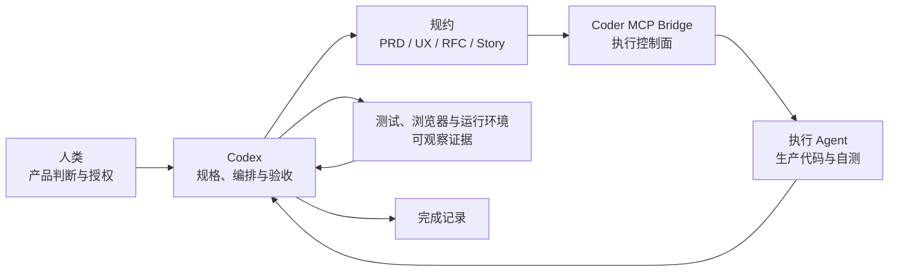
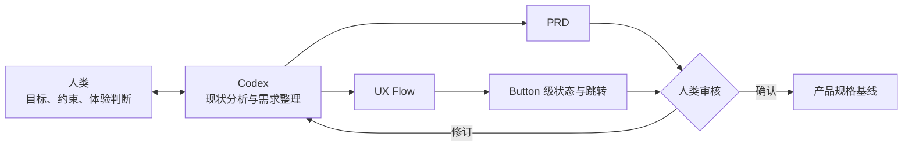
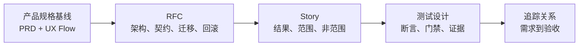
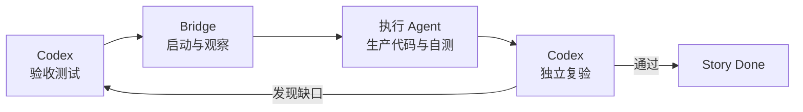

# 规约驱动的长程 Agent 开发

> Coder MCP Bridge 在需求、执行与验收分离中的作用

[English](HARNESS-CONTEXT-ENGINEERING.en.md) | 简体中文

长程 Agent 开发覆盖需求分析、体验设计、技术设计、编码、测试和发布准备。任务会跨越多轮对话与多个执行会话，产品目标、工程约束和代码状态也会持续变化。单次会话可以完成局部工作，却无法独自承载整个开发过程。

规约驱动的开发方法将需求逐级转化为 PRD、UX Flow、RFC 和 Story，再通过明确的职责边界完成实现与验收。人类负责产品判断和授权，Codex 负责规格、编排和验收，执行 Agent 负责生产代码，运行环境提供可观察证据。

Coder MCP Bridge 位于编排者和执行 Agent 之间，管理工作区、资源、会话与事件。它使规约定义的任务边界能够稳定进入编码过程，并让执行过程可以被持续观察、引导和恢复。

## 1. 长程 Agent 开发的核心问题

长程任务需要同时解决两个基础问题：局部实现必须获得足够快、足够明确的反馈，整体需求又必须在多轮执行中保持有效。前者决定 Agent 能否修正当前工作，后者决定每次局部修正是否仍然指向同一个产品目标。

### 1.1 Backpressure 的所有权

[Ralph Loop](https://ghuntley.com/ralph/) 将长程开发组织为连续的局部迭代：Agent 每轮完成一个有限任务，通过测试、类型检查、构建或其他验证信号判断结果，再根据失败继续修正。Backpressure 的作用是拒绝不满足要求的输出，使 Agent 能够确认当前修改是否产生了预期效果。

```text
局部实现 → 验证信号 → 拒绝或接受 → 下一轮修正
```

长程任务不能缺少这种反馈，但反馈由谁定义同样重要。如果生产代码和 backpressure 都由同一个执行会话维护，Agent 可以通过修改测试、替换为 Mock 数据、增加兜底分支或收缩断言，让验证信号变为通过。局部循环仍然收敛，却可能收敛到一个更容易通过的替代目标。

将 backpressure 完全交给人类可以保持验收独立，但人类需要持续编写测试、观察运行和重新下发修正，开发速度重新受限于人工反馈。全自动开发需要在两者之间建立新的边界：backpressure 可以自动产生和执行，但不能由当前实现会话同时拥有和解释。

### 1.2 上下文积累与规格衰减

Spec 编程常被理解为在会话开始时加入大量需求和设计文档，然后让 Agent 持续实现。文档虽然进入了上下文，却不等于会在整个开发过程中持续约束模型。

编码过程会不断产生文件读取结果、搜索结果、工具调用、代码差异、编译日志、测试输出、错误诊断和修复记录。这些中间信息持续占用上下文，较早载入的规格会逐渐远离当前决策位置，也可能在压缩后只保留摘要。Agent 随后只读取局部文档或根据当前代码反推需求，局部实现便开始偏离完整规格。

Subagent 调度可以分担搜索、分析和实现，却不会自动解决上下文问题。Subagent 接收到的是一次上下文投影：遗漏的业务约束不会自行恢复，不同 Subagent 也可能基于不同的文件范围、代码状态和验证口径得出结论。如果主会话继续积累所有子任务结果，日志和摘要仍会回流到同一个有限上下文。

上下文工程需要控制每轮任务读取什么、保留什么以及何时丢弃什么。产品规格和工程边界应保存在会话之外，每轮只加载当前 Story 及其直接依赖；执行日志留在局部会话，已经确认的结果回写为可追踪工件。规格由此成为每轮执行都能重新定位的约束，而非只在长会话开头出现过的背景材料。

### 1.3 实现与验收的职责冲突

执行 Agent 可以运行测试并检查自己的实现，但自测结果仍由实现过程产生。如果同一执行者还可以修改 Story、测试和验收基线，它就能够在实现过程中改变完成条件，使原始需求逐渐适配当前代码。

规约、生产代码和验收结论需要由不同责任主体持有。Codex 负责规格、验收测试和完成判定；执行 Agent 负责当前 Story 范围内的生产代码和自测；人类负责产品语义、UX 审核和编码授权。

这种职责划分同时保护两类工件：生产代码不能绕过验收标准，验收标准也不能脱离已经确认的产品规格。测试需要与 PRD、UX Flow、RFC 和 Story 保持可追踪关系，测试结果才可以作为完成证据。

## 2. 规约驱动的开发方法

这套方法从参与者及其位置出发，再进入规格形成和执行验收。协作关系确定工件由谁持有，规格链确定当前要完成什么，执行流程将规格转化为可以复验的工程状态。

### 2.1 协作与职责

#### 2.1.1 协作结构

人类位于产品决策端，执行 Agent 位于代码实现端，Codex 连接产品规格与工程交付。Coder MCP Bridge 提供两者之间的执行通道，测试、浏览器和运行环境向 Codex 返回验收证据。



#### 2.1.2 职责与修改权

| 责任主体 | 职责与修改权 |
|---|---|
| 人类 | 确定产品语义和商业规则，审核 PRD 与 UX Flow，授权进入编码阶段 |
| Codex | 维护 PRD、RFC 和 Story，编写验收测试，编排执行，审查代码并判定完成 |
| 执行 Agent | 在当前 Story 边界内修改生产代码并运行自测，不修改规格和验收基线 |
| Bridge | 管理工作区访问、资源租约、会话续接、事件观察、上下文压缩与恢复 |
| 测试与运行环境 | 提供合同、行为、界面、迁移和安全等可观察结果 |

#### 2.1.3 工件边界

每类工件都有明确的修改来源和使用方向：

```text
产品判断 → PRD / UX Flow
PRD / UX Flow → RFC
RFC → Story
Story → 验收测试与执行上下文
生产代码与运行结果 → 验收证据
验收证据 → 完成记录
```

### 2.2 规格形成

#### 2.2.1 产品规格

产品规格从人类与 Codex 的需求讨论开始。双方结合现有实现、业务规则和用户路径，形成相互对应的 PRD 与 UX Flow。PRD 规定产品目标和验收要求，UX Flow 将要求落实到页面、状态和 Button 跳转。



人类审核是产品规格的完成条件。界面图已经生成、PRD 已经成文或工具调用已经结束，都不能替代审核结论。

#### 2.2.2 工程规格

产品规格确认后，Codex 将其转化为 RFC 和 Story。RFC 建立技术边界，Story 建立执行边界，测试设计建立验收边界。



| 工件 | 保存内容 | 生效范围 |
|---|---|---|
| PRD | 产品目标、业务规则、范围和验收要求 | 产品版本 |
| UX Flow | 页面状态、Button 操作、跳转及恢复路径 | 用户路径 |
| RFC | 技术边界、接口契约、迁移与回滚 | 技术主题 |
| Story | 单一结果、代码边界、非范围和测试要求 | 一次执行单元 |
| 测试设计 | 可执行断言、回归门禁和证据要求 | Story 验收 |

#### 2.2.3 编码授权

规格完成与开始编码是两个独立状态。PRD、UX Flow、RFC 和 Story 可以先形成完整的追踪关系，但只有人类明确授权后，Codex 才能将 Story 交给执行 Agent。

授权门用于确认产品语义已经稳定、实施顺序已经接受、迁移风险已经知晓，并且当前 Story 的范围足够明确。未获授权的内容保持规格状态，不进入生产代码。

### 2.3 执行与验收

#### 2.3.1 Story 上下文

编码授权后，Codex 按 RFC 的依赖顺序选择下一个 Story。当前 Story 被整理为有限的执行上下文：

- 关联的 PRD、UX Flow 和 RFC；
- 单一交付结果；
- 允许修改的代码路径；
- 明确的范围与非范围；
- 接口、状态、安全和兼容约束；
- 验收标准与失败测试；
- 自测命令和回滚方式。

执行 Agent 只需要理解当前 Story 及其直接依赖。已经确认的全局事实继续由仓库规约保存，避免在每次执行中重新推导产品和架构。

#### 2.3.2 实现循环

Codex 先建立能够暴露当前缺口的验收测试，再通过 Bridge 获取工作区并启动执行 Agent。执行 Agent 修改生产代码、运行自测并返回结果；执行结束后，Codex 检查实际差异并独立复验。



同一 Story 的后续修复可以续接原执行会话，以保留局部实现上下文。发现的新缺口由 Codex 固化为测试或规格条件，再交回执行 Agent 修正生产代码。

#### 2.3.3 完成审计

Story 的完成状态由与风险匹配的当前证据支持，可以包括：

- Story 验收测试和相关回归；
- lint、类型检查与生产构建；
- 接口契约、权限、幂等、并发和错误处理；
- 数据库升级、降级与失败回滚；
- 真实浏览器中的页面状态、操作路径和可访问性；
- 规格、代码、测试和运行结果之间的追踪关系。

Story 完成后记录测试结果、审查结论和回滚方式。所有 Story 完成后，再依据 PRD、UX Flow、RFC、Story 和测试进行版本审计，确认产品要求与工程交付之间没有缺失环节。

## 3. Coder MCP Bridge 的 Harness 作用

第 1 章中的问题无法仅靠延长提示词或重复运行 Agent 解决。Harness 需要把 backpressure 移出实现会话，按任务分配上下文，并对执行生命周期提供独立控制。Coder MCP Bridge 不定义产品规格和验收内容，它为这些上层规则提供可执行的控制面。

| 长程任务问题 | Harness 要求 | Coder MCP Bridge 的作用 |
|---|---|---|
| Backpressure 可能被实现会话改写 | 将实现与验收分成独立控制路径 | 分离执行会话，暴露运行状态，并在工作区释放后交回验收 |
| 规格在累计上下文中衰减 | 区分项目事实与局部实现上下文 | 保留原生会话，提供上下文观察、压缩、续接和恢复 |
| 执行状态依赖 Agent 自述 | 由外部控制面管理运行和资源 | 统一事件、等待、控制、租约与终态 |

### 3.1 Backpressure 外置

Bridge 将编码实现放入独立执行会话。Codex 在会话之外持有 Story、验收测试和完成判定，执行 Agent 在会话内修改生产代码并运行自测。Agent 返回的文本、测试结果和工具事件是执行状态，不直接构成验收结论。

Bridge 的工作区访问和资源租约进一步固定了执行顺序：实现期间由执行 Agent 使用目标工作区，运行结束并释放资源后，再由 Codex 检查代码差异并重新运行验收。Backpressure 因而形成一条位于实现会话之外的反馈路径。

```text
Codex 定义验收 → Bridge 执行实现 → Codex 独立复验
```

这条路径没有要求人类逐轮编写和运行检查。Codex 可以根据规约生成 backpressure、检查真实结果并将新的失败条件再次交给执行会话，同时执行 Agent 无权通过自己的完成报告结束 Story。

### 3.2 上下文分层

项目级上下文和执行上下文具有不同的生命周期。PRD、UX Flow、RFC、Story 和测试保存在仓库中，负责跨会话维持产品事实；Bridge 会话只保存当前 Story 的代码探索、修改过程和局部诊断。

Codex 启动任务时，只向执行 Agent 交付当前 Story、直接依赖、代码边界和失败证据。Bridge 保留执行后端的原生会话，并提供上下文观察、压缩、续接、分支和恢复。同一 Story 可以沿用局部上下文，新的 Story 则重新从仓库规约建立上下文边界。

这种分层限制了日志和中间推理向全局上下文回流。Codex 通过有界事件观察执行过程，需要保留的结论进入测试、Story 或完成记录，其余过程信息继续留在执行会话中。

### 3.3 执行控制

Bridge 将不同编码 Agent 映射为一致的启动、等待、观察、引导、中断、恢复和关闭接口。上层编排不需要依赖某个 Agent 的原生输出格式，也不需要通过固定频率轮询猜测任务状态。

资源租约记录工作区和共享资源的占用关系，统一事件记录推理、工具调用、上下文和终态。执行异常时，Codex 可以中断运行、释放资源、恢复原生会话或重新启动任务，而 Story、测试和完成条件保持在执行会话之外。

Coder MCP Bridge 的价值在于把三项 Harness 约束落实到运行时：backpressure 位于实现会话之外，项目上下文与执行上下文分层，任务状态由外部控制面管理。规约驱动的方法因此不再只是一组提示词约定，而成为可以持续执行、独立复验和故障恢复的开发循环。

## 4. 使用快速指南

实际使用不需要一份覆盖全过程的长提示词。提示词只负责确定当前阶段、工作顺序、职责和停止条件；具体需求与工程约束由 PRD、UX Flow、RFC、Story 和测试承载。

### 4.1 需求与 UX

首先让 Codex 基于现有实现梳理需求，并生成可供人类审核的 UX Flow：

> 请基于当前实现和实际需求重新梳理产品体验。风格和功能以当前实现为基础，UX 图需要体现完整的用户路径；同一功能应细化到 User Flow，展示操作跳转后的 UX 状态。请调用可用的 UX 工具完成设计，本阶段不要进入编码。

人类通过连续反馈修订产品语义、页面状态、视觉方向和操作路径。关键 User Flow 应精确到 Button、触发条件、跳转结果以及失败与恢复状态。UX 审核通过后，再进入规约生成。

### 4.2 规约生成

根据已经审核的 UX 生成工程规约：

> 请根据已审核的 UX 更新 PRD，将 PRD 拆分为 RFC，再将 RFC 拆分为 Story A/B/C。Story 应是最小可执行单元，并结合现有代码确定高内聚、低耦合的模块边界；每个 Story 都要有对应的测试用例。规约完成后停止，等待我授权后续编码。

这条提示词确定了规约的生成顺序、Story 粒度、代码依据、架构原则、测试要求和编码授权门。具体接口、文件边界、非范围、迁移与回滚要求由 Codex 写入对应 RFC 和 Story，不需要继续堆入提示词。

### 4.3 编码执行

规约通过审核后，明确 Codex、Bridge 和执行 Agent 的职责并授权编码：

> 请严格按照 PRD → RFC → Story 的顺序开始执行。请通过本机的 Coder MCP Bridge 调用执行 Agent：你负责编排和拉起，执行 Agent 负责直接编码和自测，测试用例由你编写并由你验收。请考虑执行模型的能力边界，最终交付必须经过独立验证。

其中的职责关系保持不变：

```text
Codex：编排、测试和验收
Bridge：拉起并维持执行
执行 Agent：生产代码和自测
```

Codex 按依赖顺序选择 Story，先建立验收测试，再通过 Bridge 启动执行 Agent。执行 Agent 的完成报告只表示本轮执行结束；Codex 在工作区释放后检查代码并独立复验。发现缺口时继续当前 Story，验证通过后记录证据，再进入下一个 Story。
